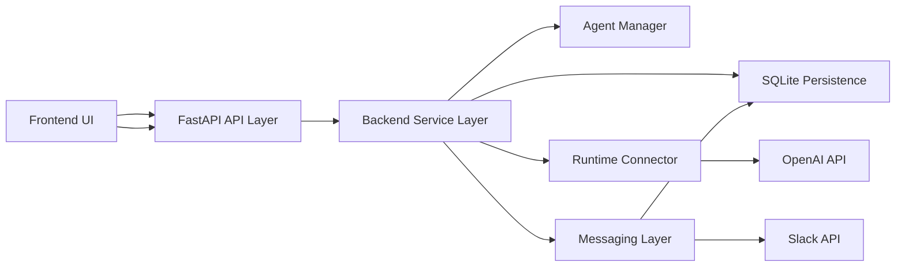

# AI Agent Orchestration

This repository contains a minimal AI orchestration demo with clear separation
between UI (FastAPI), agent runtime integration (connectors), and data/persistence
(in-memory services for tests). The project's purpose is to provide a safe,
testable scaffold for building agent-driven workflows.

**Architecture**

Why this runtime choice
- The repo ships lightweight, dependency-free scaffolding for runtimes.
- Use `connectors/autogen` to integrate AutoGen when available; `connectors/openai`
  demonstrates a small HTTP client. This keeps the core app decoupled from
  any single orchestration runtime so you can swap or test implementations.

Setup
1. Create a Python 3.10+ venv and activate it.
2. Install requirements: `pip install -r backend/requirements.txt`
3. Install the backend package in editable mode: `pip install -e backend`
4. Start the app from the repository root:
   `python -m uvicorn app.main:app --app-dir backend --reload --port 8000`

If you are already inside the `backend/` folder, use:
   `python -m uvicorn app.main:app --reload --port 8000`

Persistence
- The backend now uses SQLite by default to persist agents and messages.
- The default database file is `backend/aiagent.db`.
- Override the path with `AIAGENT_DB_PATH` in your environment.

Tests
- Run tests from repository root: `python -m pytest -q`
- The test suite includes agent creation, workflow execution, message delivery,
  API integration, and SQLite persistence coverage.

Demo
- Start the backend from `backend/` and the frontend from `frontend/`.
- The UI supports creating agents, running workflows, and viewing persisted
  message history.
- Use `OPENAI_API_KEY` to enable real agent execution.
- Use `SLACK_BOT_TOKEN` to enable Slack delivery and run the
  `slack-broadcast` workflow template.
- Supported templates:
  - `two-agent-conversation`
  - `slack-broadcast`

Running the demo
1. `cd backend`
2. `pip install -r requirements.txt`
3. `pip install -e .`
4. `set OPENAI_API_KEY=<your-key>`
5. `set SLACK_BOT_TOKEN=<your-slack-token>` (optional for Slack)
6. `python -m uvicorn app.main:app --app-dir backend --reload --port 8000`
7. `cd frontend`
8. `npm install --legacy-peer-deps`
9. `npm run dev`
10. Open the Vite frontend and create agents, run workflows, and inspect history.

CI
- GitHub Actions is configured in `.github/workflows/python-tests.yml` to
  install dependencies, install the backend package, and run the test suite.

Adding workflow templates
- Create new modules under `backend/app/workflows/` and expose a factory
  function that returns a callable accepting `(agent_manager, messenger,
  runtime_connector, agent_id, payload)`.
- This repo ships two built-in templates: `two-agent-conversation` and
  `slack-broadcast`, which demonstrate asynchronous agent handoff and Slack
  broadcast workflows.

Adding messaging channels
- Implement a class that follows the `send_message(channel, text)` interface
  (see `backend/app/services/messaging.py`). Add a concrete adapter under
  `connectors/` (for example `connectors/slack/slack_client.py`) and wire it
  into the services layer via dependency injection in your route or bootstrap.
- Slack is supported out of the box with `SLACK_BOT_TOKEN`, and channels can
  be specified as `slack:#general` to send messages through Slack.
# AI Agent Orchestration — MVP

Monorepo scaffold for an AI agent platform MVP.

Folders:
- `backend/` — FastAPI service
- `frontend/` — React + TypeScript app (Vite)
- `connectors/` — example connector implementations (OpenAI, Slack)
- `infra/` — Docker Compose and infra helpers
- `docs/` — architecture and onboarding docs

Quick start (development):

Backend

- Create a Python virtualenv and install requirements in `backend/`.

Frontend

- `cd frontend` then `npm install` and `npm run dev` (Vite)

See `docs/getting_started.md` for more details.

For a runnable end-to-end demo with sample workflows and Slack setup, see `docs/demo.md`.

## Agent Runtime Integration

This repository includes an optional scaffold for integrating an agent
orchestration runtime. The initial integration choice is **AutoGen** — a
lightweight, agent-focused orchestration framework.

- **Why AutoGen:** AutoGen is well-suited for coordinating multiple
	agents and tools, offers flexible runtime modes (local or remote), and
	interoperates easily with existing LLM connectors such as the
	OpenAI client in `connectors/openai`.
- **Opt-in usage:** The AutoGen scaffold lives in `connectors/autogen` and
	is optional. Install AutoGen with `pip install autogen` to enable
	orchestration features and follow the README in that folder.

See `connectors/autogen/README.md` for installation instructions and a
small example snippet.
